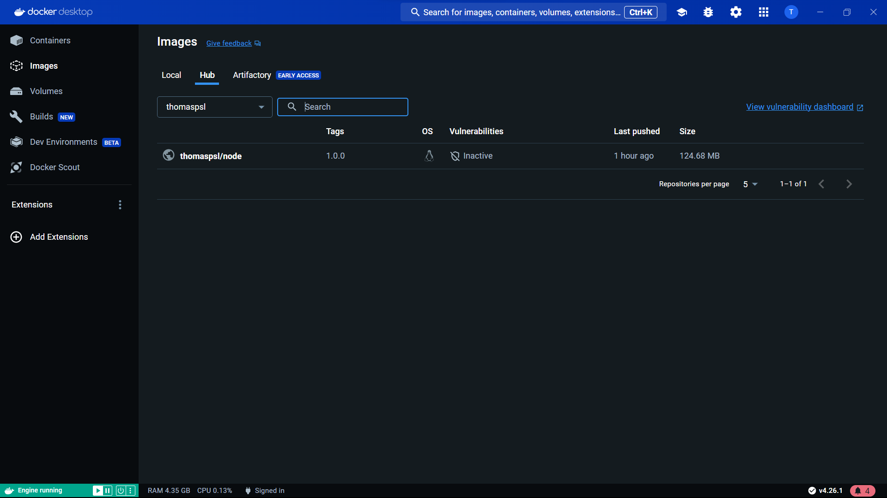

<h1 align="center">Master - Docker</h1>

# Partie 1 : Fondamentaux des conteneurs et Docker

## 1. Concepts conteneur

La conteneurisation est une manière de regrouper une application et toutes ses dépendances au sein de ce qu'on appelle "un conteneur". Les conteneurs permettent d'utiliser moins de ressources sur une infrastructure qu'une machine virtuel, puisqu'ils sont plus légers et bien plus efficaces.

Voici les 4 principes des conteneurs :

### Isolation

Les conteneurs sont isolés les uns des autres au niveau du système d'exploitation, ce qui signifie qu'ils ne peuvent pas interagir entre eux. Cela permet d'éviter les conflits entre applications et d'améliorer la sécurité et la fiabilité.

### Portabilité

Les conteneurs peuvent être exécutés sur n'importe quelle infrastructure compatible avec la plateforme de conteneurisation utilisée. Cela permet aux développeurs de créer des applications qui peuvent être déployées sur une variété de systèmes, y compris les clouds publics, les clouds privés et les infrastructures locales.

### Efficacité

Les conteneurs sont plus efficaces que les machines virtuelles. Ils utilisent moins de ressources, ce qui permet de réduire les coûts d'infrastructure. Une machine virtuelle a besoin d'un système d'exploitation, alors qu'un conteneur n'a besoin que du code, des bibliothèques et des dépendances nécessaires à l'exécution de l'application. Cela signifie qu'un conteneur utilise moins de mémoire, de CPU et d'espace disque qu'une machine virtuelle.

### Scalabilité

Les conteneurs sont faciles à mettre à l'échelle. Les applications conteneurisées peuvent être facilement déployées et retirées en masse. Cela permet aux entreprises d'adapter leur infrastructure à la demande.

Les différences entre Machines Virtuelles et Conteneurs :

<p align="center">
    
</p>

Les machines virtuelles sont des environnements d'exécution complexe qui incluent un système d'exploitation, des applications, etc. Elles sont plus lourdes que les conteneurs et nécessitent plus de ressources.

Les conteneurs eux sont des unités d'exécution plus légères. Ils sont plus efficaces que les machines virtuelles et utilisent moins de ressources puisqu'ils n'embarquent pas la couche concernant un OS.

## 3. Commandes de base

Parmi les principales commandes on peut retrouver : 

```bash
# Gestion des images

## Pour télécharger / publier une image Docker sur un registre Docker 
$ docker pull / push <nom_image>
## Pour construire une image à partir d'un Dockerfile
$ docker build -t <nom_image> <chemin_du_Dockerfile>

# Gestion des conteneurs

## Pour lancer un conteneur à partir d'une image
$ docker run <options> <nom_image>
## Pour lister les conteneurs en cours d'exécution
$ docker ps
## Pour arrêter un conteneur en cours d'exécution
$ docker stop <id_ou_nom_conteneur>
## Pour redémarrer un conteneur arrêté
$ docker start <id_ou_nom_conteneur>
## Pour supprimer un conteneur
$ docker rm <id_ou_nom_conteneur>

# Gestion des réseaux

## Pour afficher la liste des volumes Docker
$ docker network ls
## Pour créer un nouveau volume Docker
$ docker network create <nom_reseau>

# Gestion des volumes

## Pour afficher la liste des volumes Docker
$ docker volume ls
## Pour créer un nouveau volume Docker
$ docker volume create <nom_volume>

# Autres commandes utiles

## Pour afficher les journaux d'un conteneur en cours d'exécution
$ docker logs <id_ou_nom_conteneur>
## Pour lister les images Docker disponibles
$ docker images
```
Screen prouvant que mon application fonctionne :
<p align="center">
    
</p>

Les commandes utilisées :
```bash
# Pour récupérer l'image de nginx
$ docker pull nginx

# Pour voir si l'image s'est ajouté
$ docker images

# Pour lancer le serveur
$ docker run -d -p 8080:80 nginx
```

## 4. Volumes Docker

Nous devions installer mariadb puis créer des données au sein de la base.
```bash
# Pour récupérer l'image de mariadb
$ docker pull mariadb 

# Pour voir si l'image s'est ajouté
$ docker images

# Pour lancer le serveur de base
$ docker run --name mariadb -e MYSQL_ROOT_PASSWORD=mypass -p 3306:3306 -d docker.io/library/mariadb
```

Nous nous sommes rendu compte que les données n'étaient pas persistante à la suppression du container. Pour régler ce problème, nous sommes passés par la création d'un volume.
```bash
# Pour créer un volume de la base
$ docker volume create mariadb_volume

# Pour lancer le serveur de base avec la persistance des données
$ docker run --name mariadb -v mariadb_volume:/var/lib/mysql -e MYSQL_ROOT_PASSWORD=mypass -p 3306:3306 -d docker.io/library/mariadb
```

Screen prouvant que la persistance des données :
<p align="center">
    
</p>
<p align="center">
    
</p>

Les volumes Dockers sont des espaces de stockage qui sont rendus disponibles pour les conteneurs. Cela permet de stocker des données persistantes qui ne seront pas perdues lorsque le conteneur est arrêté ou supprimé. L'utilité des volumes est donc de permettre le stockage de données persistantes, comme des bases de données, des fichiers de configuration ou des logs.

Les applications stateless ne stockent pas d'informations entre les requêtes, favorisant la simplicité et la scalabilité. A l'inverse, les applications stateful conservent des informations sur l'état, ce qui peut compliquer la mise à l'échelle. En Docker, la plupart des conteneurs sont conçus comme stateless, ils externalisent l'état via des bases de données externes. Pour des applications stateful dans Docker, la gestion de l'état nécessite souvent l'utilisation de volumes.

## 5. Reseaux Docker

Docker propose plusieurs modes de réseau pour faciliter la communication entre conteneurs et avec le réseau hôte. Parmi les modes de réseau courants, il y a :

- Bridge Network : Mode par défaut, permet la communication entre conteneurs sur le même hôte avec des adresses IP internes.

- Host Network : Donne au conteneur un accès direct au réseau de l'hôte, améliorant les performances mais exposant directement les ports du conteneur.

- Overlay Network : Facilite la communication entre conteneurs sur différents hôtes, créant un réseau virtuel superposé pour les déploiements distribués.

- Macvlan Network : Donne au conteneur des adresses MAC et IP réelles sur le réseau sous-jacent, utile pour intégrer des conteneurs dans un réseau existant.

- None Network : Désactive l'accès au réseau pour le conteneur, approprié lorsque la communication réseau n'est pas nécessaire.

Le choix du mode de réseau dépend des exigences spécifiques de l'application, de la facilité de gestion, de la sécurité et de la nature du déploiement (local, externe, etc.). En général, Bridge Network et Overlay Network sont parmi les plus couramment utilisés dans une variété de scénarios, Bridge Network puisque c'est celui par défaut et Overlay Network puisqu'il permet de farie de gros déploiement. 

Listes de commandes :
```bash
# Pour lister les réseaux docker
$ docker network ls

# Pour voir quel réseau appartient un conteneur
$ docker inspect --format '{{.HostConfig.NetworkMode}}' mariadb
```

## 6. Exercice Pratique

-> Prof demande de passer à la suite

# Partie 2 : Approfondissement des Connaissances

## 1. Écrire son Image Docker

Mon application fonctionnelle :

<p align="center">
    
</p>

Voici l'url du dockerfile : [Dockerfile](https://github.com/thomaspsl/MASTER_Docker/blob/master/projets/devops-training-nodejs/Dockerfile)

## 2. Optimisation de l’image Docker

Lignes de développement :
```bash
# Créer une image sous registry avec l'utilisation de Dockerfile
$ docker build -t thomaspsl/node_vue:1.0.0 .

# Créer le conteneur à l'aide du docker-compose
$ docker-compose --project-name uglydockerfile up -d
```

Application avec l'image docker allégée :

<p align="center">
    
</p>

<p align="center">
    
</p>

## 3. Stack Multi-Service

Pour avoir une application fonctionnelle sur le localhost:80, dans le docker-compose il faut ajouter au conteneur de wordpress le port associé par conséquent : 
```bash
ports:
  - "80:80"
```
Pour configurer les variables d'environemment il faut ajouter les lignes suivantes (sachant que 'mariadb_wordpress' permet la liaison avec la base de données MariaDB qui se trouve sur un autre conteneur): 

```bash
environment:
    WORDPRESS_DB_HOST: mariadb_wordpress
    WORDPRESS_DB_USER: root
    WORDPRESS_DB_PASSWORD: example
    WORDPRESS_DB_NAME: wordpress
```

## 4. La Docker Registry

Dans une entreprise interne, un registry est une solution pour avoir une base organisée pour stocker les ressources. 

Cela peut faciliter la collaboration entre les équipes, améliore la transparence et garantit la conformité aux normes internes. Il contribue également à renforcer la sécurité des informations gérant les contrôles d'accès et en facilitant son administration.

Image de mon Docker Hub : [thomaspsl/node:1.0.0](https://hub.docker.com/repository/docker/thomaspsl/node/general)

<p align="center">
    
</p>

## 5. Exercice Pratique

Lien de l'image front_client : [front](https://hub.docker.com/layers/thomaspsl/front_client/1.0.0/images/sha256:209e5e431245818429c49803ca29cd5b881ce58acda8109aa69fd60d7edaa084?uuid=A21C0124-BDA1-4003-86B4-CF4F80B7729A)

Lien de l'image back_server : [back](https://hub.docker.com/layers/thomaspsl/back_server/1.0.0/images/sha256:881109f36def38baf5094ed3aca7c3d71c40eae1797905c04399e18bfd393552?uuid=A21C0124-BDA1-4003-86B4-CF4F80B7729A)

Lien du projet GitHub : [MASTER_ApiGraph](https://github.com/thomaspsl/MASTER_Docker/tree/master/projets/MASTER_ApiGraph)

# Partie 3 : Orchestration de conteneurs

## 1. Cluster & Orchestration

### Clusterisation des conteneurs

La clusterisation des conteneurs est une technique qui permet de regrouper des conteneurs individuels pour former un système plus complexe. Les outils de clusterisation comme Kubernetes automatisent les tâches de gestion des conteneurs, ça facilite le déploiement et la maintenance des applications conteneurisées.

### Concept de microservice

Les microservices constituent une architecture logicielle dans laquelle une application est divisée en plusieurs ensemble de petits services indépendants. Chaque service est responsable d'une fonction spécifique et peut être développé, déployé et mis à l'échelle de manière indépendante.

### Scalability, Availability, et Load Balancing :

Scalability : C'est la capacité d'un système à s'adapter à une augmentation de charge. Cela signifie que le système peut gérer plus de trafic ou de demandes sans perdre de performance ou de disponibilité.

Availability : C'est la capacité d'un système à être accessible et opérationnel. Elle est généralement mesurée par le temps de disponibilité, c'est-à-dire la durée pendant laquelle le système est accessible.

Load Balancing : C'est une pratique qui répartit la charge du trafic entre plusieurs instances d'un service. Cela permet d'optimiser l'utilisation des ressources et d'éviter la surcharge d'un seul nœud.

La clusterisation des conteneurs offre des avantages pour résoudre des problèmes d'évolutivité, de disponibilité, et d'équilibrage de charge. Elle permet l'ajout ou la suppression de nœuds pour permettre d'améliorer le système.

Parmi les outils qui permettent d'orchestrer des clusters de conteneurs, il y a : 
- Kubernetes 
- Docker Swarm
- Amazon ECS 

## 2. Docker Swarm

-> Trop long

## 3. Kubernetes

Un cluster Kubernetes a plusieurs noeuds différents, parmi ceux existant il y a :

Kubelet : C'est un agent qui s'occupe des conteneurs sur chaque nœud d'un cluster Kubernetes. Il communique avec le contrôleur de cluster pour s'assurer que les conteneurs sont déployés correctement et qu'ils fonctionnent correctement.

Container Runtime : C'est le logiciel qui permet d'exécuter des conteneurs sur un nœud Kubernetes. Il peut être Docker, containerd, ou un autre runtime compatible.

Kube Proxy : C'est un composant qui gère la communication réseau entre les services Kubernetes. Il permet aux services de communiquer entre eux et avec le monde extérieur.

cAdvisor : C'est un outil qui collecte des données sur l'utilisation des ressources et les performances des conteneurs. Ces données sont utilisées par le Kubelet pour surveiller les nœuds Kubernetes.

Pods: C'est un groupe de conteneurs qui sont traités comme une unité unique. Les conteneurs au sein d'un pod partagent un espace réseau et peuvent se communiquer entre eux.

Kube DNS : C'est un service qui permet d'accéder aux services Kubernetes par leur nom au lieu de leur adresse IP.

Pause Container : Chaque pod inclut un conteneur de pause qui fournit un espace réseau et un espace de noms communs à tous les conteneurs du pod.

Node Status: Le composant qui enregistre l'état d'un nœud Kubernetes, y compris les ressources disponibles, la capacité mémoire, et d'autres informations importantes.

Kubelet API Server : Le Kubelet expose une API qui permet au contrôleur de cluster de communiquer avec lui pour gérer les conteneurs et les pods.